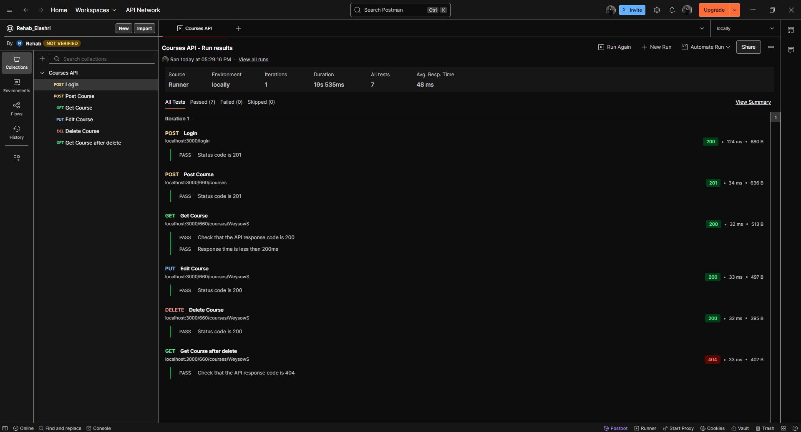
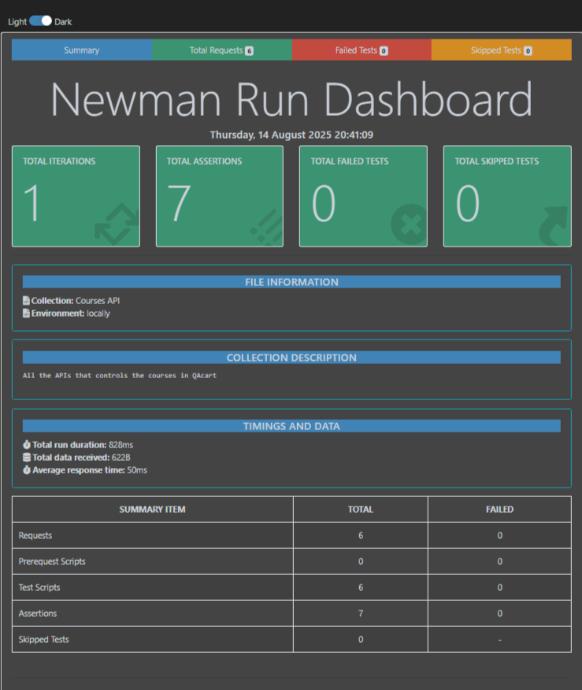

# QAcart API Project 🚀

This project contains the **Postman** files for API tests, along with illustrative screenshots.

---

## 📌 Project Contents
- **Postman Collection** (API requests)
- **Postman Environment** (environment settings)
- **Screenshots** (located in the 'images/' folder)

---

## 🖼️ Screenshots

### 🔹 Postman Interface

### 🔹 Collection Example

---

## 🛠️ How to Use
1. Open Postman.
2. Import the files inside the project.
3. Start executing requests and tracking responses.

---

## 👩‍💻 QC
- **Rehab Elashri**
